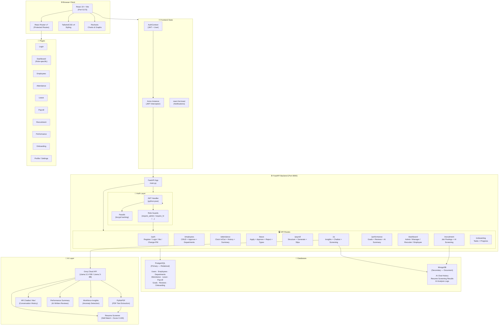
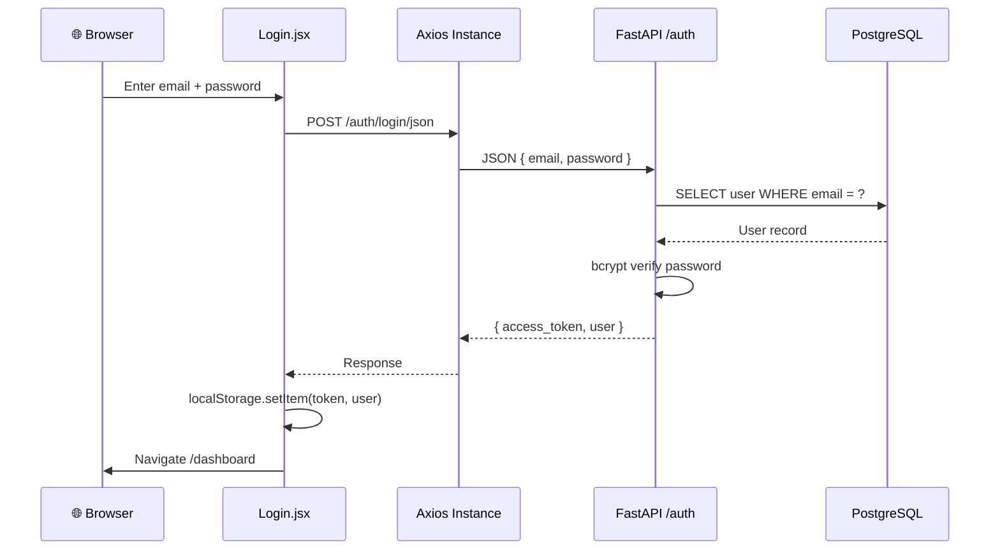
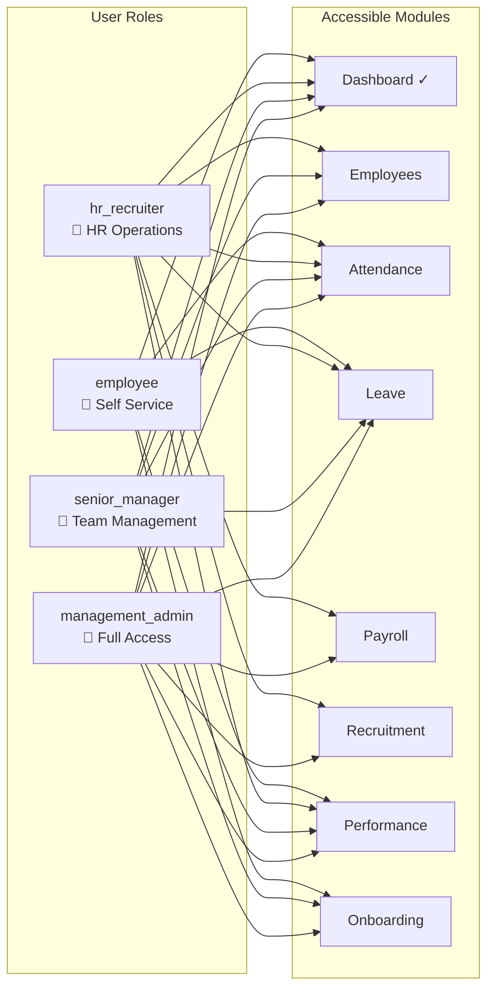
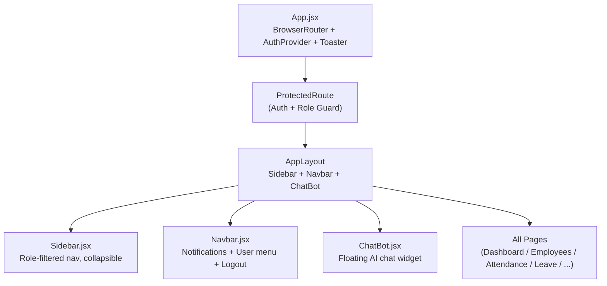
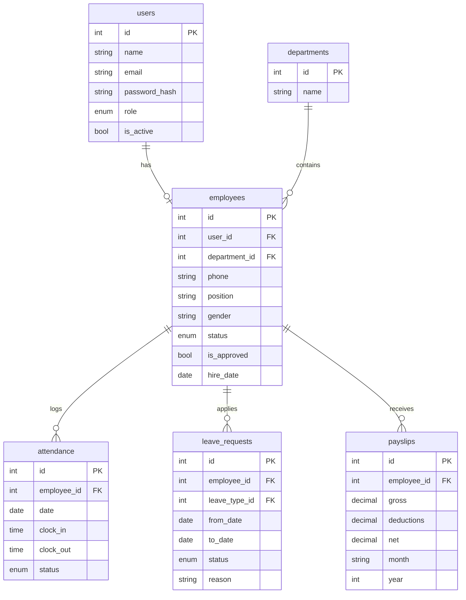

# AI-HRMS — System Architecture

## Overview

AI-HRMS is a full-stack Human Resource Management System built on a decoupled frontend/backend architecture with two databases (PostgreSQL and MongoDB) and Groq AI for intelligent features.

---

## System Architecture Diagram

---

## Data Flow

### Authentication Flow

---

### Role-Based Access Control

---

## Component Architecture

---

## Database Schema (PostgreSQL)

---

## API Endpoint Summary

| Prefix | Endpoints | Auth Required |
|--------|-----------|---------------|
| `/auth` | `POST /register`, `POST /login`, `POST /login/json`, `GET /me`, `PUT /me`, `POST /change-password` | Mixed |
| `/employees` | `GET /`, `POST /`, `GET /{id}`, `PUT /{id}`, `PATCH /{id}`, `DELETE /{id}`, `PUT /{id}/approve`, `GET /departments`, `GET /stats` | Admin / HR / Manager |
| `/attendance` | `POST /clock-in`, `POST /clock-out`, `GET /today`, `GET /my`, `GET /team`, `GET /summary` | All |
| `/leave` | `GET /types`, `POST /apply`, `GET /my`, `GET /pending`, `PUT /{id}/approve`, `PUT /{id}/reject` | All |
| `/payroll` | `POST /salary-structure`, `POST /generate`, `GET /my`, `GET /all` | Admin / HR |
| `/recruitment` | `GET /jobs`, `POST /jobs`, `PUT /jobs/{id}`, `DELETE /jobs/{id}` | Admin / HR |
| `/performance` | `GET /goals`, `POST /goals`, `GET /reviews`, `POST /reviews`, `GET /ai-summary` | All |
| `/dashboard` | `GET /admin`, `GET /manager`, `GET /recruiter`, `GET /employee` | Role-specific |
| `/ai` | `POST /screen-resume`, `POST /chat`, `GET /insights`, `GET /payroll-anomalies` | Authenticated |
| `/onboarding` | `GET /tasks`, `POST /tasks`, `PUT /tasks/{id}` | All |

---

## Environment Variables

### Backend `.env`

| Variable | Description | Default |
|----------|-------------|---------|
| `DATABASE_URL` | PostgreSQL connection URL | `postgresql+asyncpg://...` |
| `MONGODB_URL` | MongoDB connection URL | `mongodb://localhost:27017` |
| `MONGODB_NAME` | MongoDB database name | `aihrms` |
| `SECRET_KEY` | JWT signing secret (32+ chars) | *(required)* |
| `ALGORITHM` | JWT algorithm | `HS256` |
| `ACCESS_TOKEN_EXPIRE_MINUTES` | Token TTL | `1440` (24h) |
| `GROQ_API_KEY` | Groq Cloud API key for AI features | *(optional)* |
| `FRONTEND_URL` | CORS allowed origin | `http://localhost:5173` |

### Frontend `.env`

| Variable | Description | Default |
|----------|-------------|---------|
| `VITE_API_URL` | Backend API base URL | `http://localhost:8000` |
